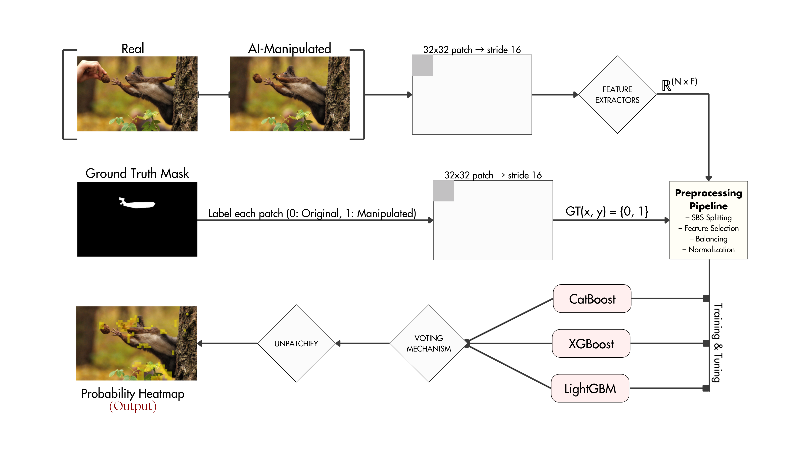
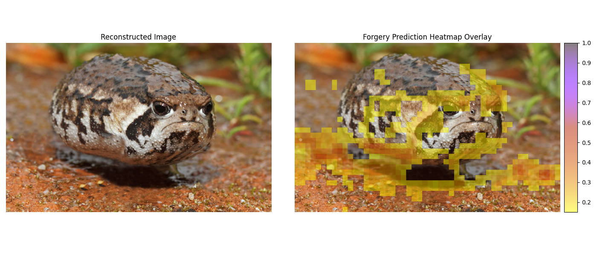
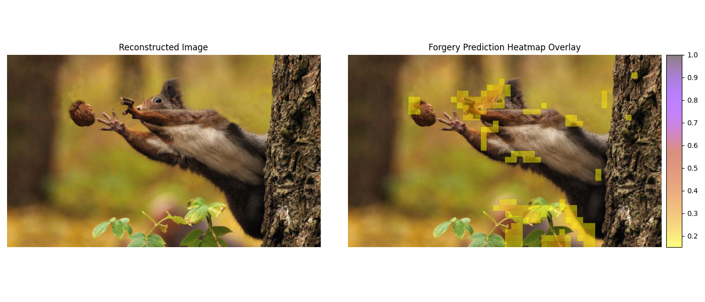

# PatchForens: A Patch-wise Approach for Forensic Analysis of AI-Manipulated Images Using Feature Extraction and Class Ensemble Learning



PatchForens is a lightweight, patch-wise forensic framework designed to detect **localized AI-manipulated regions** in images. 

By extracting a rich 637-dimensional feature set (frequency, texture, statistical, noise residual, and gradient domains) from overlapping patches, applying robust feature selection (Information Gain + Symmetrical Uncertainty), and using **Similarity-Based Stratified Splitting (SBSS)** to prevent data leakage, the system feeds refined features into a powerful stacked ensemble of **XGBoost + LightGBM + CatBoost** with a logistic regression meta-learner.

## 🔑 Key Features

- **Rich Feature Extraction Pipeline:** Extracts the top-100 traditional 2D spatial and frequency features per patch, including:
  - Noise Residuals
  - High-pass Residual Block Variance
  - Wavelet (LL, LH, HL, HH Bands)
  - Fast Fourier Transform (FFT Log Power)
  - Discrete Cosine Transform (DCT)
  - Local Binary Patterns (LBP)
  - Gray-Level Co-occurrence Matrix (GLCM Log Scale)
  - Global Statistics
  - Laplacian Statistics
  - Gradient Statistic Moments (GSM)
  - Histogram of Oriented Gradients (HOG)
  - Color Histogram HSV
  - Chroma Correlation (Cb Channel)
- **Optimized for Class Imbalance:** Employs smart thresholding, feature selection (Information Gain & Symmetric Uncertainty), and binary undersampling (SBSS) to tackle the inherent 14:1 pristine-to-forged class imbalance in real-world forensic datasets.
- **Tree-Based Meta-Ensemble:** Stacks powerful base classifiers (`XGBoost`, `CatBoost`, `LightGBM`) and aggregates their probabilities using a `LogisticRegression` Meta-Learner for optimal Weighted Voting.
- **Dynamic Mask Unpatchification:** Automatically re-assembles 1D patch predictions back into a 2D spatial overlay (heatmap) to highlight forged regions directly over the original image.

## ⚙️ Installation

### Prerequisites

- Python 3.10 or higher
- Scikit-Learn, OpenCV (cv2), NumPy, SciPy, Matplotlib
- XGBoost, CatBoost, LightGBM

1. **Clone the repository:**
```bash
git clone https://github.com/Shreacker/PatchForens.git
cd PatchForens
```

2. **Create a virtual environment and install dependencies:**
```bash
python -m venv .venv

# Activate on Windows:
.venv\Scripts\activate
# Activate on Linux/Mac:
source .venv/bin/activate

pip install -r requirements.txt
```

## 🚀 Getting Started

### Basic Usage

Let's run the interactive demo to extract features from a target image and generate a forgery prediction heatmap overlay.

You can see a demonstration of how our system works by running `demo/demo.py`. Simply change the `IMG_PATH` variable inside the script to point to your desired target image.

And start the process by:
```bash
python .\demo\demo.py
```




## 🛠️ Development

If you wish to train the models or run the entire pipeline from scratch, follow these sequential steps:

### 1. Download the IMD2020 Dataset:
Download the dataset used for training at this address: [IMD2020 Dataset](https://staff.utia.cas.cz/novozada/db/)

### 1. Indexing the Dataset
Begin by indexing your local copy of the dataset to generate a structured mapping of the pristine and forged image pairs.
* **Script:** `indexer/IMD2020_Indexer.py`
* Run this script to generate the initial index dictionaries required for the next steps.

### 2. Feature Extraction
Extract the forensic features from the indexed dataset. 
* **Scripts:** 
  * Run extraction via: `feat_extract.py`
  * Customize or add new features in: `feature_extractors/extractors.py`

> [⚠️ !CAUTION]
> **Large Dataset Warning:** The dataset is extremely large and feature extraction is highly memory and time intensive. It is strongly recommended to extract features in smaller chunks to avoid crashing your machine. You can do this by changing the slice range in the script. For example:
> `sample_dict = dict(list(index_dict.items())[:50])`

### 3. Data Preprocessing
Preprocess the extracted raw feature matrices. This step handles normalization, robust scaling, and feature selection to prepare the data for the classifiers.
* **Script:** `data_preprocessing/data-preproc.py`

### 4. Training Base Models
Once the data is preprocessed, you can train the individual base classifiers (XGBoost, CatBoost, LightGBM).
* **Directory:** `training/`
* Execute the respective training scripts in this folder to generate the initial model checkpoints.

### 5. Ensemble Meta-Learning
Finally, stack the predictions of the trained base models and evaluate on Validation set.
* **Script:** `main.py`
* Running this script ensembles the models' checkpoints with soft voting and weighted voting mechanisms.
